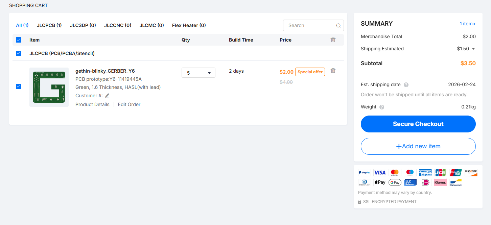

# Gethin Blinky
I made this project with Hackclub Blueprint's YSWS where I designed and built the PCB in KiCad, got it manufactured by JLCPCB and hand soldered on all the components at home.

The project schematic, PCB positioning, 3D model preview and JLCPCB cart screenshot are below:

